**Endless Nigthmare Ritual**

Integrantes:

- Arantza Monique Mercado Moreno
- Julián Berges Navarrete
- Juan Carlos Luz Gallardo

## _Documento de Diseño de Juego_
##
## _Index_

---

1. [Index](#index)
2. [Diseno del Juego](#game-design)
    1. [Summary](#summary)
    2. [Gameplay](#gameplay)
    3. [Mindset](#mindset)
3. [Technical](#technical)
    1. [Screens](#screens)
    2. [Controls](#controls)
    3. [Mechanics](#mechanics)
4. [Level Design](#level-design)
    1. [Themes](#themes)
        1. Ambience
        2. Objects
            1. Ambient
            2. Interactive
        3. Challenges
    2. [Game Flow](#game-flow)
5. [Development](#development)
    1. [Abstract Classes](#abstract-classes--components)
    2. [Derived Classes](#derived-classes--component-compositions)
6. [Graphics](#graphics)
    1. [Style Attributes](#style-attributes)
    2. [Graphics Needed](#graphics-needed)
7. [Sounds/Music](#soundsmusic)
    1. [Style Attributes](#style-attributes-1)
    2. [Sounds Needed](#sounds-needed)
    3. [Music Needed](#music-needed)
8. [Schedule](#schedule)

## _Diseno del Juego_

---

### **Descripcion del juego**

Este juego de suspenso tipo TCG y roguelite, consiste en la historia de un detective el cual debe enfrentarse a un culto para descubrir la verdad de una catatástrofe ocurrido hace años y el origen de esta misma. Deberá explorar laberintos antes de cada enfrentamiento donde podrá conseguir recursos que lo ayudarán a derrotar a sus enemigos, pero siempre procurando mantenerse vivo, ya que el uso de cartas exige como sacrificio su sangre. 

### **Jugabilidad**

El juego toma lugar en el año 2005, donde la humanidad se enfrenta a demonios que fueron originados por una catástrofe ocurrida tiempo atrás. El jugador toma el papel de un detective, el cual debe buscar el origen de los demonios y la catástrofe que lo inició todo. Para lograrlo, el jugador deberá recorrer 
distintos mapas de lugares abandonados donde se enfrentará a miembros de un culto que quieren impedir que el jugador descubra la verdad de todo.

La meta del juego es que el jugador avance en tres mapas diferentes y pelee para ir descubriendo secretos. Para enfrentar a los miembros del culto que quieren
detenerlo, al jugador se le brindarán cartas de combate con las cuales puede realizar conexiones con los demonios y así usarlos para enfrentar al villano. El jugador
debe tener en cuenta que el uso de estas cartas conlleva un sacrificio, donde aquellas cartas que sean más débiles, consumirán menos cantidad de sangre del jugador.

Esta mecánica de juego se basa en que primero se le darán cinco cartas para iniciar. En cada partida, cuando el jugador logre vencer a tres demonios del contrincante,
se le brindará una carta más fuerte que las que ya tiene, sin embargo que requiere más sacrificio, es decir, más sangre para poder ser usada. 

La segunda mecánica del juego consiste en exploración, donde antes de llegar al miembro del culto, el jugador deberá recorrer un laberinto dentro de cierto
intervalo de tiempo. Dentro de este habrán cofres que contienen cartas de demonios que al jugador le servirán o secretos sobre la causa de la catástrofe. 

El escenario principal consiste en un bosque, es decir, el inicio del juego. El jugador tendrá tres opciones de mapas, los cuales serán una escuela, un hospital y un laboratorio, donde los tres deberán ser lugares abandonados. Cada que el jugador entre a uno de estos niveles, el laberinto y la posición de los premios cambiarán de lugar para que el jugador no pueda aprenderse los mapas. Si el jugador llega a perder contra el enemigo, se reiniciará el juego y regresará al bosque principal como si hubiera despertado de una pesadilla. Al regresar, su nivel de sangre regresará al 100% pero conservará las cartas recolectadas.

Los laberintos deberán ser recorridos dentro de un tiempo límite, depende del nivel en el que se encuentran para que el jugador deba decidir entre recuperar conseguir cartas o pelear con sus cartas iniciales. Secretos sobre la historia detrás de todo. En caso de no haber logrado recorrer el laberinto dentro de ese tiempo, el jugador será enviado nuevamente al inicio y habrá perdido todo lo reunido en ese intento.

Mecánicas y reglas del juego:
- Exploración de laberintos dentro de un tiempo límite.
- Sacrificio de sangre para el uso de cartas de demonios.
- El jugador deberá vencer al jefe final de cada nivel para poder ganar el nivel. Vence al jefe final tras derrotar a 3 de sus demonios 

### **Sentimiento del Jugador**

El juego tendrá un temática principal de terror y suspenso. La mentalidad que se busca causar en el jugador es de miedo, donde se hará uso de elementos como
sonidos y música para hacer sentir nervioso al jugador. Se busca hacer sentir débil al jugador donde piense que en cualquier momento será asustado, además de
tener prisa de terminar el laberinto de forma rápida dado que en este se encontrará a oscuras.

Para crear la temática de terror, implementamos una lámpara la cual será la única luz dentro del laberinto, esto crea una sensación de impotencia y con el tiempo presionando se crea más suspenso y una adrenalina para acabar el laberinto sin perder.  

## _Técnico_

---

### **Interfazes del Usuario**

## 1. Pantalla Principal 
Pantalla inicial del juego donde el jugador accede a las opciones principales.

### Opciones:
- **Nueva Partida**  
  Inicia una nueva aventura desde el principio.

- **Continuar**  
  Retoma el progreso guardado del jugador.

- **Ajustes**  
  Permite modificar configuraciones como audio, controles y gráficos.

- **Créditos**  
  Muestra información sobre los desarrolladores del juego.

Ejemplo del menú:

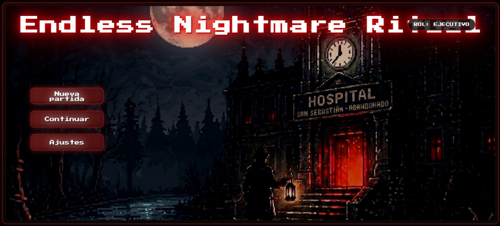

---

## 2. Lobby 
Área central donde el jugador elige a dónde ir antes de cada run.

### Opciones de Nivel:
- **Escuela Abandonada**  
  Primer nivel, dificultad baja.

- **Hospital Abandonado**  
  Nivel intermedio, mayor tensión y enemigos más fuertes.

- **Laboratorio Abandonado**  
  Nivel avanzado, mayor dificultad .

Ejemplo de la escuela abandonada
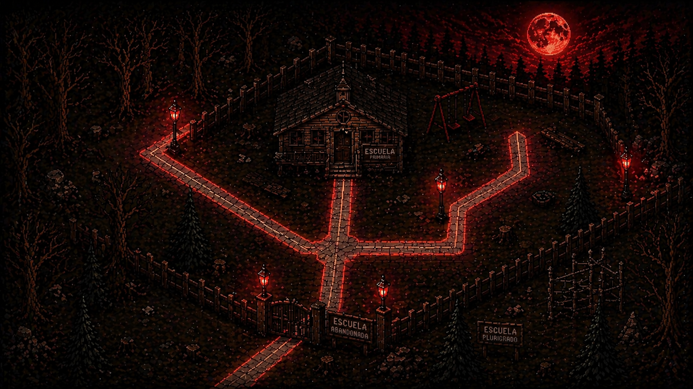 

---

### Inventario
Accesible desde el lobby. Permite al jugador revisar sus cartas y secretos.

#### Secciones:

**A. Cartas**
- Muestra todas las cartas obtenidas del usuario 

Ejemplo de las cartas en el inventario

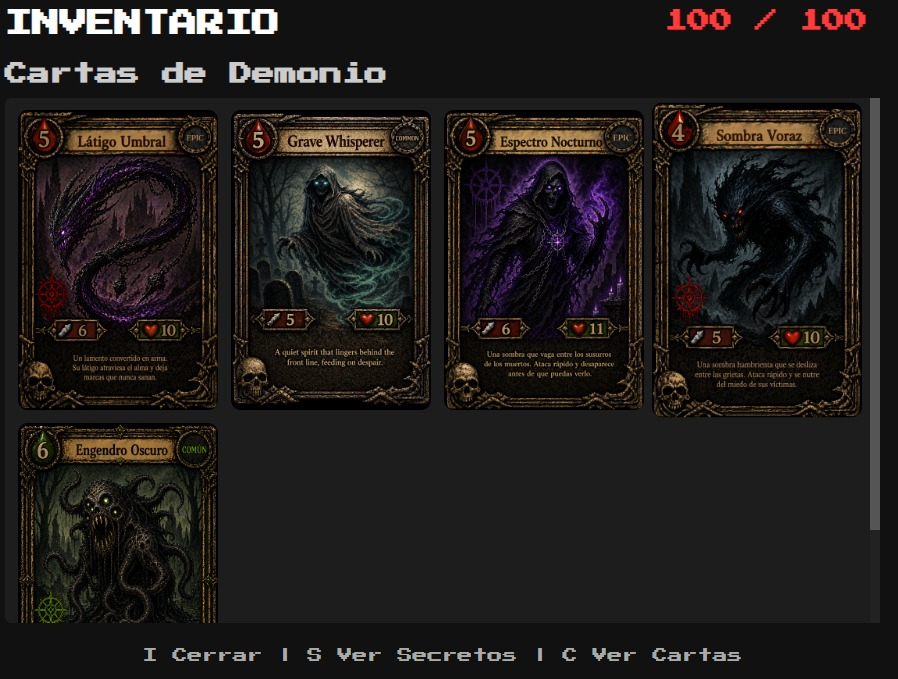

**B. Secretos**
- Muestra los secretos de historia desbloqueados

Ejemplo de los secretos en el inventario

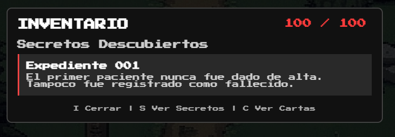

---

## 3. Laberinto (Exploración)

### 3.1 Laberinto Base
- El laberinto se genera con un DFS (Depth Fisrt Search) de manera alaetoria cada run. 
- Contiene:
  - Caminos y paredes
  - Zona de entrada
  - Salida aleatoria

Imagen del jugador adentro del laberinto

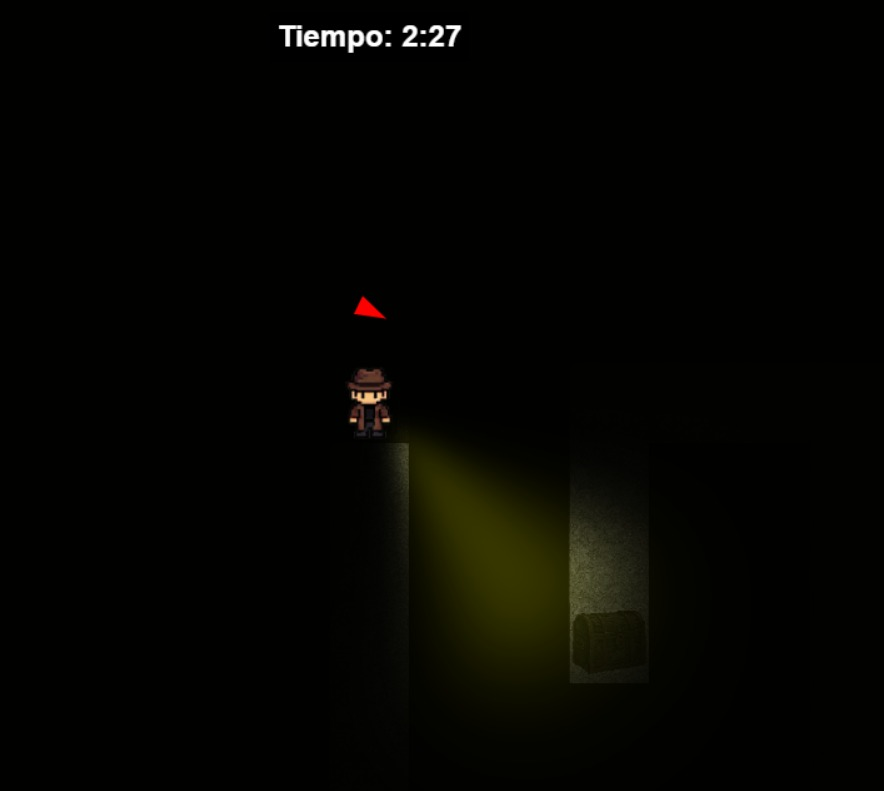

### 3.2 Cofres del Laberinto
Objetos interactivos que otorgan recompensas al jugador como cartas o secretos

#### Tipos de Cofres:

**A. Cofre de Carta**
- Contiene únicamente una carta de demonio 

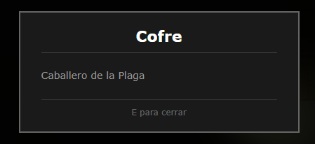

**B. Cofre de Carta + Secreto**
- Este cofre contiene una carta y un secreto del juego 

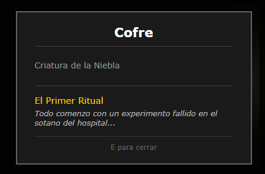

---

## 4. Combate TCG (Pantalla de Pelea)

#### Elementos del Jugador:
- Mano de cartas (parte inferior)
- Carta activa
- Cartas en la fila 
- Cartas en banco 
- Indicador de sangre
- Contador de cartas derrotadas (KO)
- Botones
    - Atacar 
    - Terminar (terminar su turno)
    - Sacrificar

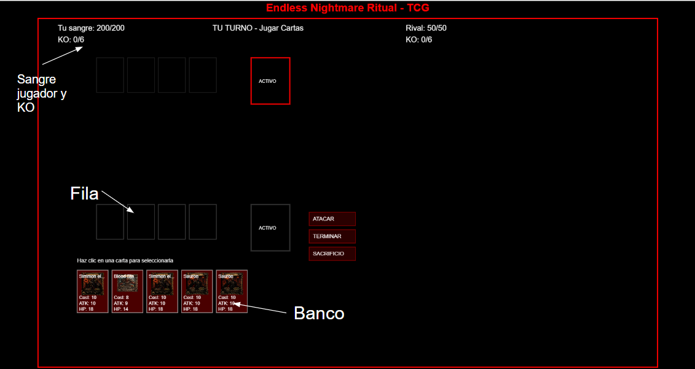

#### Elementos del Enemigo:
- Carta activa
- Cartas en banco
- Indicador de sangre
- Contador de KO

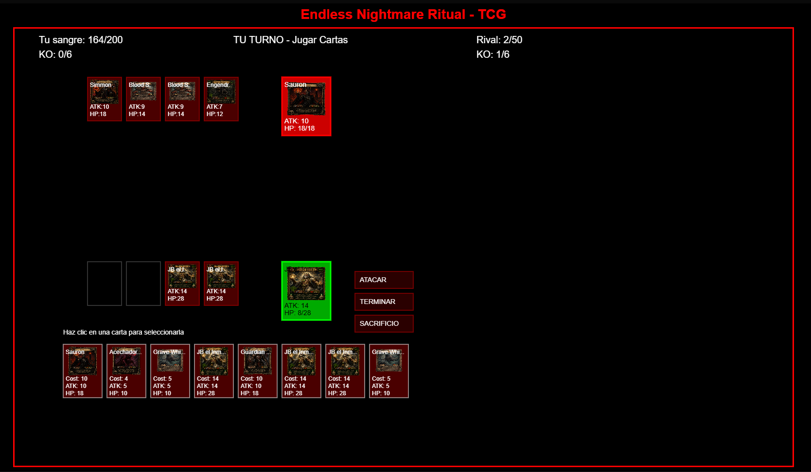

### Resultado del Combate:
- **Victoria**
  - Obtención de las cartas que el jugador consiguió  
  - Desbloque el siguiente nivel

  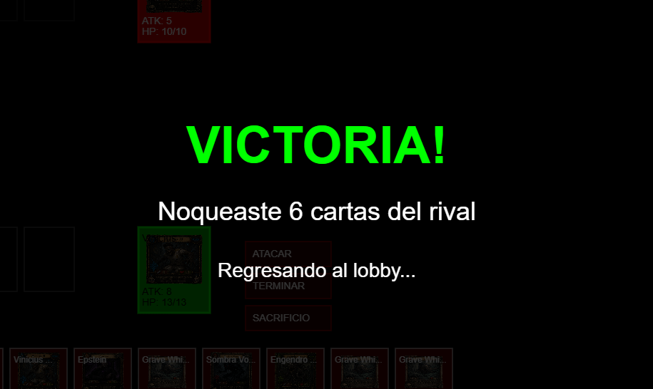

- **Derrota**
  - Regreso al lobby
  - Pierde todo su progreso de dicho nivel, pierde cartas, secretos. 

  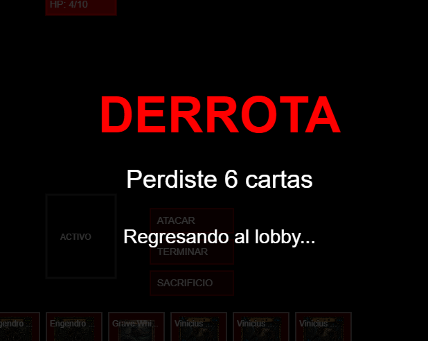

### **Controls**

El jugador podrá interactuar con el juego por medio del teclado y su mouse, donde para la sección de los laberintos, podrá moverse con las teclas W, A, S y D o las flechas del teclado, donde los laberintos mantendrán al jugador entre las paredes. Tambien con el mouse o usando el touchpad se puede mover la literna de forma voluntaria.Para otras interacciones como el juego de cartas (selección de cartas) el jugador podrá usar el clic izquierdo del mouse. El mouse se usará para interacciones como elección de cartas o para recolectar los diferentes objetos de los laberintos. 

### Mecánicas

## 1. Mecánica de Exploración

La exploración es una de las mecánicas principales del juego y se divide en dos partes: lobby y laberinto.

---

### 1.1 Exploración en el Lobby

El lobby funciona como un hub central donde el jugador puede moverse libremente.

#### Características:
- Permite elegir a qué nivel acceder dependiendo paso el nivel anterior:
  - Escuela abandonada
  - Hospital abandonado
  - Laboratorio abandonado
- Desde aquí también se puede acceder al inventario.

### 1.2 Exploración en el Laberinto

Cada nivel contiene un laberinto generado proceduralmente que el jugador debe recorrer antes del combate, ahi podra recolectar cartas y secretos.

#### Características del laberinto:
- Generación aleatoria en cada partida.
- Distribución dinámica de cofres y salida.
- Sistema de oscuridad con visibilidad limitada.
- Tiempo límite para completar la exploración.

### 1.3 Cofres del Laberinto

Durante la exploración, el jugador encontrará cofres que contienen cartas o secretos o las dos.

#### Contenido de los cofres:
- Cartas de demonios
  - Pueden ser temporales o permanentes dependiendo del resultado del run, se usan para pelear con los miembros del culto. 

- Secretos
  - Fragmentos de historia sobre el culto y contexto, se usa para ambientar al jugador y saber mas de la historia. 
  - Se almacenan en el inventario del jugador tambien depende del resultado de la run. 

### 1.4 Riesgo y Recompensa

El jugador debe tomar decisiones estratégicas durante la exploración:

- Explorar más → mayor recompensa  
- Explorar demasiado → riesgo de perder todo por tiempo  

### 1.5 Condición de Fallo

- Si el jugador no completa el laberinto a tiempo:
  - Pierde todos los recursos recolectados
  - Es regresado al lobby

- El juego le marcará al jugador que cuenta con un tiempo n dependiendo del nivel para poder recorrer el laberinto. Si lo logra dentro del tiempo, podrá llegar con los recursos que recolectó. De lo contrario, si el tiempo se le acabó al jugador, este será regresado al inicio y perderá los elementos que recogió y que recorer el laberinto otra vezz.

- Para lograr esto, se utilizará una generación DFS depth search first , nuevas para que el laberinto sea diferente cada vez que el jugador ingresa. Además, siguiendo con la temática de terror y suspenso, en los laberintos el jugador estará casi completamente a oscuras y tendrá una linterna con la cual ver su camino. Para
esto se utilizará una máscara para dar ese efecto donde el personaje está sin luz.
- El jugador tendrá colisiones con las paredes del laberinto para impedir que atravies los objetos del mapa.

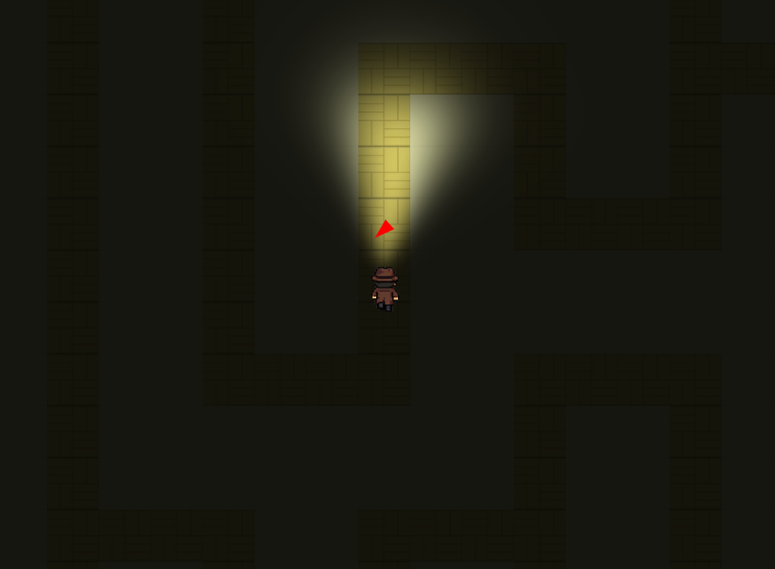 

--- 
### Mecanica de Combate: 

El combate es por turnos entre el detective y un miembro del culto. Ambos utilizan cartas de demonios que invocan pagando sangre como recurso. 

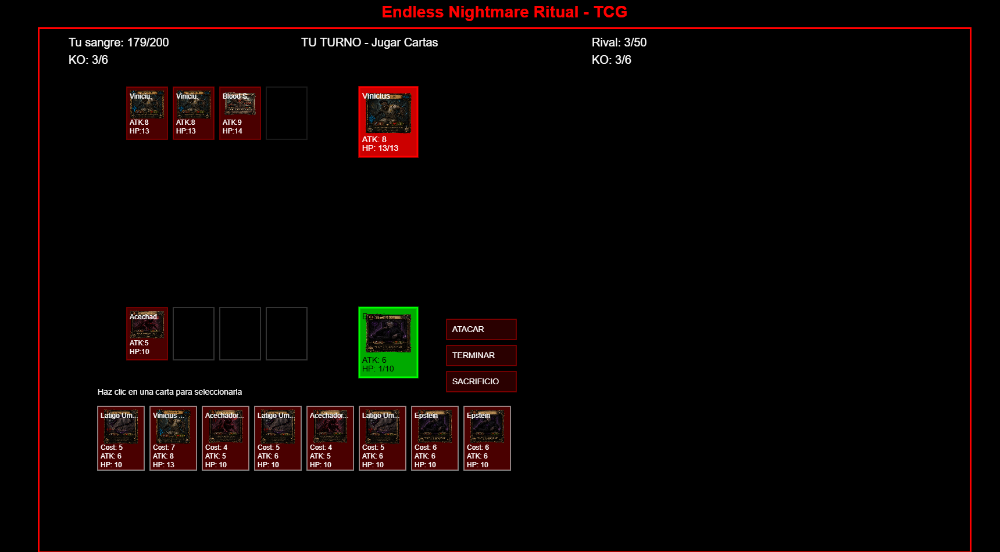

### Estructura general 
| Elemento | Jugador | Boss |
|---|---|---|
| Recurso | Sangre (máx 200) | Sangre (máx 200) |
| Cartas en mano | Todas las cartas de su deck | todas las cartas de su deck  |
| Demonios activos en campo | 1 a la vez | 1 a la vez |
| Cartas jugadas por turno | 1 | 1 |
| Condición de victoria | Matar 6 demonios del boss | Matar 6 demonios del jugador |

Al ganar el combate al jugador se le otroga todas sus cartas y secretos obtenidos en el laberinto

Flujo del Combate: 

- Ambos jugadores eligen una carta la cual sera usada para pelear, no saben que carta eligio el otro.
- Se puede poner cartas en tu fila para que sea la siguente carta la cual se mueva al activo
- Cada carta tiene sus atributos (Costo de sangre, dano, HP) 
- Si el HP de un demonio llega a 0, esa carta se descarta y cuenta como un demonio derrotado (KO).
 
## _Level Design_

---

### Ambiente del juego 

1. Escuela abandonada
    1. Mood
        1. Oscuro, callado, suspenso
    2. Objects
        1. _Ambient_
            1. Sillas rotas
            2. Mesas rotas
            3. Libros rotos
        2. _Interactive_
            1. Miembros del culto
            2. Cartas nuevas de demonios
            3. Secretos sobre la catástrofe
            4. Cofres 
            5. Entrada de la escuela 

2. Hospital abandonado
    1. Mood
        1. Oscuro, callado, suspenso
    2. Objects
        1. _Ambient_
            1. Sangre en el piso
            2. Camillas rotas
            3. Equipos médicos dañados
            4. Luces que parpadean.
            5. Esqueletos
        2. _Interactive_
            1. Miembros del culto
            2. Cofres
            3. Cartas nuevas de demonios
            4. Secretos sobre la catástrofe
            5. Entrada hospital

1. Laboratorio abandonado
    1. Mood
        1. Oscuro, callado, suspenso
    2. Objects
        1. _Ambient_
            1. Vidrios rotos
            2. Sangre en las paredes
            3. Computadoras dañadas
            4. Material de laboratorio en el suelo
        2. _Interactive_
            1. Miembros del culto
            2. Cofres
            3. Cartas nuevas de demonios
            4. Secretos sobre la catástrofe
            5. Entrada laboratorio 

### **Game Flow**

1. El jugador carga en el lobby y inicia el juego. 
2. Podrá moverse en 8 direcciones haciendo uso del teclado.
3. Como primer nivel a ganar estará en la escuela abandonada.
4. El jugador obtiene 5 cartas demonio para empezar. 
5. El jugador entra por la puerta de la escuela y llega a otro cuarto.
6. El jugador recorre un laberinto y recoge premios (cartas o secretos).
7. Llega al final y se encuentra con el miembro del culto.
8. Pelea por turnos contra el enemigo y sacrifica sangre.
9. Vence al enemigo final del nivel y gana el nivel. 
11. Desbloquea el siguiente nivel (hospital abandonado).
12. Si el jugador pierde, regresa al bosque sin sus cartas y secretos. 

## _Development_

---
### **Clases Abstractas / Componentes**

1. **BaseGameObject**
   1. Posición
   2. Tamaño
   3. Sprite
   4. Área de colisión

2. **BaseCharacter**
   1. BasePlayer
   2. BaseEnemy

3. **BasePlayer**
   1. Movimiento
   2. Sangre
   3. Inventario
   4. Deck

4. **BaseEnemy**
   1. Estadísticas del enemigo
   2. Deck del enemigo
   3. Comportamiento en combate

5. **BaseCard**
   1. Costo de sangre
   2. Daño
   3. HP
   

6. **BaseMaze**
   1. Generación del laberinto
   2. Paredes
   3. Salida
   4. Colocación de cofres

7. **BaseInteractable**
   1. Cofres
   2. Puertas
   3. Botones de inventario
   4. Botones de combate

8. **BaseUI**
   1. Menú principal
   2. UI del lobby
   3. UI de inventario
   4. UI de combate
   5. Botton ESC 

### **Clases Derivadas / Composición de Componentes**

1. **BaseGameObject**
   1. **Wall (Pared)**
      - Representa las paredes del laberinto
      - Bloquea el movimiento del jugador

   2. **Door (Puerta)**
      - Permite entrar a niveles o salir del laberinto

   3. **Chest (Cofre)**
      - Contiene recompensas como cartas o secretos

---

2. **BasePlayer**
   1. **DetectivePlayer**
      - Personaje principal jugable
      - Se mueve por lobby y laberintos
      - Puede recolectar cartas y secretos
      - Usa cartas en el combate TCG

3. **BaseEnemy**
   1. **CultMember**
      - Enemigo básico del culto

   2. **SchoolBoss**
      - Jefe del nivel escuela

   3. **HospitalBoss**
      - Jefe del nivel hospital

   4. **LaboratoryBoss**
      - Jefe final del laboratorio

   5. **EnemyDemonCard**
      - Cartas usadas por los enemigos en combate

4. **BaseCard**

   1. **BaseDemonCard**
      - Carta normal encontrada en cofres

5. **BaseMaze**

   1. **SchoolMaze**
      - Laberinto del nivel escuela
      - Dificultad baja

   2. **HospitalMaze**
      - Laberinto intermedio
      - Mayor dificultad y tensión

   3. **LaboratoryMaze**
      - Laberinto más difícil
      - Menor tiempo y enemigos más fuertes

6. **BaseInteractable**
   1. **InteractableChest**
      - Se abre al interactuar
      - Contiene:
        - Carta
        - Secreto

   2. **InteractableDoor**
      - Permite cambiar de escena o nivel

   3. **InventoryButton**
      - Abre el inventario del jugador

   4. **CombatButton**
      - Permite acciones:
        - Atacar
        - Terminar turno
        - Sacrificio

7. **BaseUI**
   1. **MainMenuUI**
      - Nueva partida
      - Continuar
      - Ajustes
      - Créditos

   2. **LobbyUI**
      - Selección de nivel
      - Acceso a inventario

   3. **InventoryUI**
      - Sección de cartas
      - Sección de secretos

   4. **MazeUI**
      - Temporizador
      - Popup de cofres

   5. **CombatUI**
      - Mano de cartas
      - Carta activa
      - Cartas en banco
      - Indicador de sangre
      - Botones de acción

## _Graphics_

---

### **Style Attributes**

El juego utilizará una paleta de colores oscuros y desaturada para hacer sentir al jugador en una atmósfera de suspenso y misterio. La escuela y el hospital
al ser lugares abandonados tendrán tonos grisáceos y azules. Lo que más destacará de la estética será la sangre para recuperar (color rojo), las cartas demonio (color morado/rojizo) y los secretos (color amarillo).

- El estilo que se busca es un pixel art 2D donde los personajes no tendrán muchos detalles.
- Uso de colores apagados para los escenarios.
- Personajes y enemigos con siluetas claras y fáciles de identificar.
- Objetos interactivos con contraste mayor respecto al fondo.
- Sombras suaves para reforzar la atmósfera de terror.
- Diseño simple pero consistente para mantener claridad visual durante la exploración.
- Objetos interactivos tendrán un pequeño brillo o resaltado cuando el jugador esté cerca.
- Cuando el jugador reciba daño, la pantalla mostrará un flash rojo breve.
- Al derrotar un enemigo, aparecerá un efecto visual de desaparición o energía oscura.

### **Graphics Needed**

1. Characters

-Detective (jugador)

  - Animaciones necesarias:
    - Caminar (arriba, abajo, izquierda, derecha)
    - Idle (reposo)
    - Interacción / investigación

2. Blocks

Elementos base utilizados para construir los mapas y laberintos.

    - Piso de escuela (tiles)
    - Piso de hospital (tiles)
    - Pared rota
    - Puertas / entradas
    - Pasillos
    - Piso de salón de clases
    - Corredores oscuros

3. Ambient
    - Broken desks
    - School lockers
    - Hospital beds
    - Wheelchairs
    - Blood stains
    - Ritual symbols on the floor
    - Candles
    - Cult symbols on walls

4. Other
    - Estilo: Pixel Art 2D
    - Paleta:
    - Colores oscuros y desaturados
    - Rojo para elementos importantes (sangre, peligro)
    - Iluminación:
    - Uso de sombras y zonas oscuras para generar tensión
    - Feedback visual:
    - Resaltado de objetos interactivos
    - Efectos al abrir cofres o interactuar

## _Sounds/Music_

---

### **Style Attributes**

Again, consistency is key. Define that consistency here. What kind of instruments do you want to use in your music? Any particular tempo, key? Influences, genre? Mood?

La música del juego tendrá un estilo oscuro y atmosférico para reforzar la sensación de misterio y peligro. Se utilizarán sonidos ambientales y música lenta para crear tensión durante la exploración.

Stylistically, what kind of sound effects are you looking for? Do you want to exaggerate actions with lengthy, cartoony sounds (e.g. mario&#39;s jump), or use just enough to let the player know something happened (e.g. mega man&#39;s landing)? Going for realism? You can use the music style as a bit of a reference too.

- Pasos del jugador al caminar por el escenario.
- Sonido de apertura de cofres o interacción con objetos.
- Efectos oscuros o mágicos al usar cartas demonio.
- Sonido de impacto cuando el jugador recibe daño.
- Sonidos ambientales como viento, ecos o crujidos en los edificios abandonados.

 Remember, auditory feedback should stand out from the music and other sound effects so the player hears it well. Volume, panning, and frequency/pitch are all important aspects to consider in both music _and_ sounds - so plan accordingly!

 Los sonidos importantes tendrán mayor claridad para que el jugador pueda identificarlos fácilmente.

### **Sounds Needed**

1. Effects
    1. Soft Footsteps (dirt floor)
    2. Sharper Footsteps (stone floor)
    3. Soft Landing (low vertical velocity)
    4. Hard Landing (high vertical velocity)
    5. Glass Breaking
    6. Chest Opening
    7. Door Opening
2. Feedback
    1. Relieved &quot;Ahhhh!&quot; (health)
    2. Shocked &quot;Ooomph!&quot; (attacked)
    3. Happy chime (extra life)
    4. Sad chime (died)

_(example)_

1. Effects
    1. Soft footsteps 
    2. Sharper footsteps 
    3. Card draw sound
    4. Card play 
    5. Chest opening 
    6. Puerta la abrirse opening
    7. Sangre al recoger 
    8. Maze timer 

2. Feedback
    1. Relieved &quot;Ahhhh!&quot; (health)
    2. Shocked &quot;Ooomph!&quot; (attacked)
    3. Happy chime (extra life)
    4. Sad chime (died)

### **Music Needed**

1. Slow-paced, nerve-racking &quot;forest&quot; track
2. Exciting &quot;castle&quot; track
3. Creepy, slow &quot;dungeon&quot; track
4. Happy ending credits track
5. Rick Astley&#39;s hit #1 single &quot;Never Gonna Give You Up&quot;

_(example)_

1. Musica:
    1. Pista ambiental espeluznante y de ritmo lento para el menú principal
    2. Pista tensa y atmosférica para la exploración del laberinto
    3. Pista urgente y de ritmo acelerado para los últimos 15 segundos del temporizador
    4. Pista oscura y ritualista para los combates TCG
    5. Pista dramática de jefe para los encuentros con el CultLeader
    6. Pista sombría de "game over" (cuando la sangre llega a 0%)
    7. Pista triunfal para los créditos finales

## _Schedule_

---

1. develop base classes
    1. base entity
        1. base player
        2. base enemy
        3. base block
  2. base app state
        1. game world
        2. menu world
2. develop player and basic block classes
    1. physics / collisions
3. find some smooth controls/physics
4. develop other derived classes
    1. blocks
        1. moving
        2. falling
        3. breaking
        4. cloud
    2. enemies
        1. soldier
        2. rat
        3. etc.
5. design levels
    1. introduce motion/jumping
    2. introduce throwing
    3. mind the pacing, let the player play between lessons
6. design sounds
7. design music

_(example)_

1. Develop base classes (week 1)
    1. Base physiscs 
        1. base detective
        2. base enemigos 
        3. base objectos

    2. Base cards
    3. Base maze
    4. Base obstaculos
    5. Base mundo  
        1. mundo del juego 
        2. menu del mundo 
        3. Area de combate 

2. Develop player and basic block classes (week 2)
    1. Físicas y colisiones 
    2. Movimiento del jugador (detective)
    3. Objectos interactibles (sangre, cartas en cofres)

3. Find some smooth controls/physics (week 3)
    1. Generacion del maze 
    2. Timer

4. Develop other derived classes (week 4)
    1. Cartas base
        1. Costo
        2. Dano 
        3. Type
    2. Cartas evolucionadas 
    3. Comabte UI 
    4. Condicion de victoria

5. Develop of enemy classes (week 5)
    1. Boss 1 
    2. Boss 2 
    3. Boss final 
    4. Demonios del enemigo 

6. Database integration (week 6)
    1. Player stats 
    2. Card stats 
    3. Combat stats 
    4. Exploration stats 

7. Design levels ()
    1. introduce motion
    2. introduce maze exploration
    3. mind the pacing, let the player play between lessons
    
8. Design sounds
9. Design music
10. Testing 

