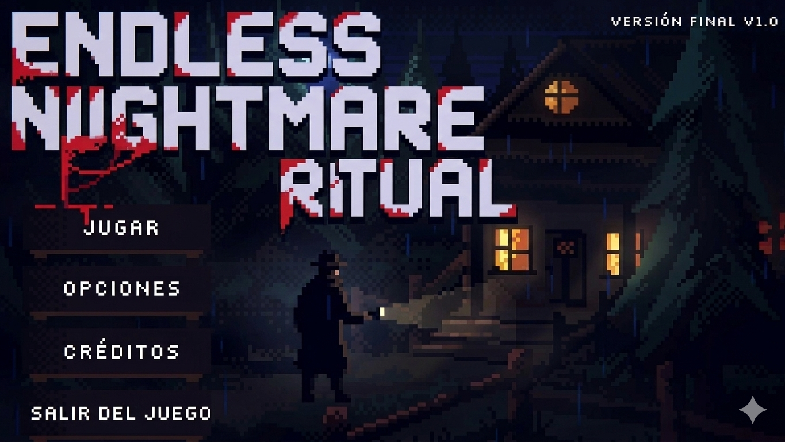
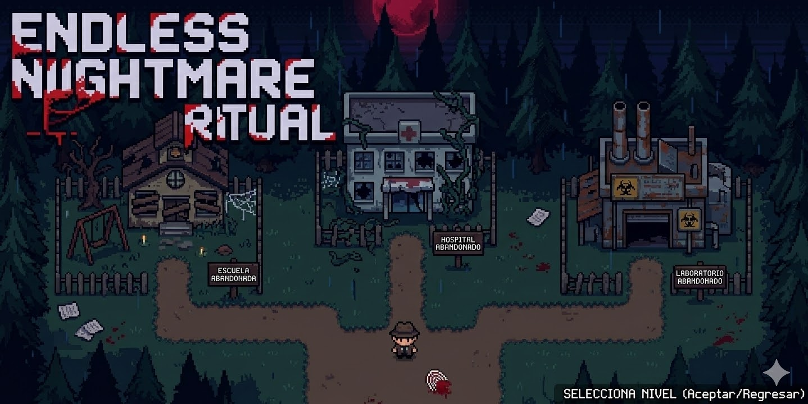
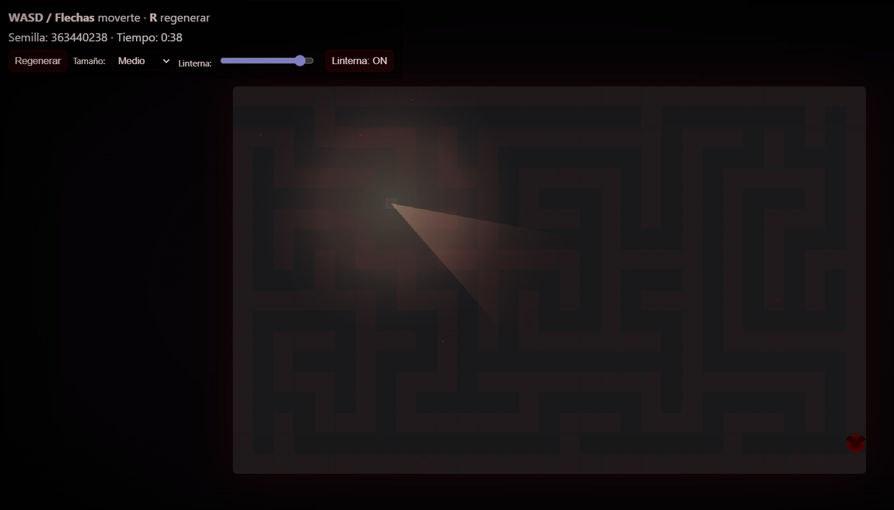
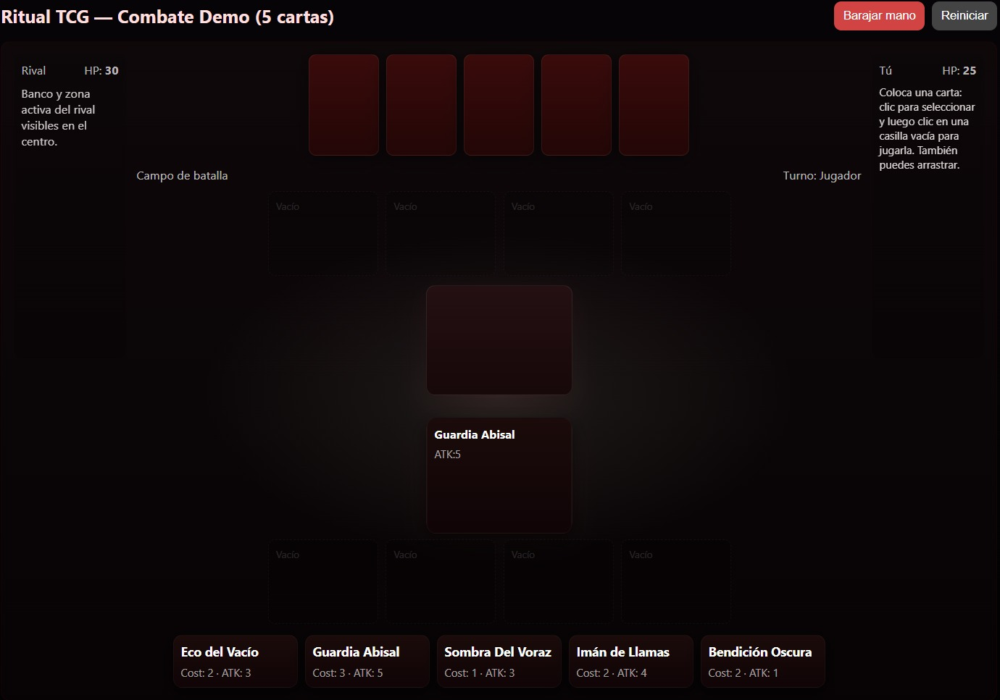

99999# **Endless Nigthmare Ritual**

## _Game Design Document_

---

##### **Copyright notice / author information / boring legal stuff nobody likes**

##
## _Index_

---

1. [Index](#index)
2. [Game Design](#game-design)
    1. [Summary](#summary)
    2. [Gameplay](#gameplay)
    3. [Mindset](#mindset)
3. [Technical](#technical)
    1. [Screens](#screens)
    2. [Controls](#controls)
    3. [Mechanics](#mechanics)
4. [Level Design](#level-design)
    1. [Themes](#themes)
        1. Ambience
        2. Objects
            1. Ambient
            2. Interactive
        3. Challenges
    2. [Game Flow](#game-flow)
5. [Development](#development)
    1. [Abstract Classes](#abstract-classes--components)
    2. [Derived Classes](#derived-classes--component-compositions)
6. [Graphics](#graphics)
    1. [Style Attributes](#style-attributes)
    2. [Graphics Needed](#graphics-needed)
7. [Sounds/Music](#soundsmusic)
    1. [Style Attributes](#style-attributes-1)
    2. [Sounds Needed](#sounds-needed)
    3. [Music Needed](#music-needed)
8. [Schedule](#schedule)

## _Game Design_

---

### **Summary**

Sum up your game idea in 2 sentences. A kind of elevator pitch. Keep it simple!

Este juego de suspenso tipo TCG y roguelite, consiste en la historia de un detective el cual debe enfrentarse a un culto para descubrir la verdad de una catatástrofe
ocurrida hace años y el origen de esta misma. Deberá explorar laberintos antes de cada enfrentamiento donde podrá conseguir recursos que lo ayudarán a derrotar
a sus enemigos, pero siempre procurando mantenerse vivo, ya que el uso de cartas exige como sacrificio su sangre.

### **Gameplay**

What should the gameplay be like? What is the goal of the game, and what kind of obstacles are in the way? What tactics should the player use to overcome them?

El juego toma lugar 20 años después de la época actual, donde la humanidad se enfrenta a demonios que fueron originados por una catástrofe ocurrida tiempo atrás. El jugador toma el papel de un detective, el cual debe buscar el origen de los demonios y la catástrofe que lo inició todo. Para lograrlo, el jugador deberá recorrer 
distintos mapas de lugares abandonados donde se enfrentará a miembros de un culto que quieren impedir que el jugador descubra la verdad de todo.

La meta del juego es que el jugador avance en tres mapas diferentes y pelee para ir descubriendo secretos. Para enfrentar a los miembros del culto que quieren
detenerlo, al jugador se le brindarán cartas de combate con las cuales puede realizar conexiones con los demonios y así usarlos para enfrentar al villano. El jugador
debe tener en cuenta que el uso de estas cartas conlleva un sacrificio, donde aquellas cartas que sean más débiles, consumirán menos cantidad de sangre del jugador.

Esta mecánica de juego se basa en que primero se le darán cinco cartas para iniciar. En cada partida, cuando el jugador logre vencer a tres demonios del contrincante,
se le brindará una carta más fuerte que las que ya tiene, sin embargo que requiere más sacrificio, es decir, más sangre para poder ser usada.

La segunda mecánica del juego consiste en exploración, donde antes de llegar al miembro del culto, el jugador deberá recorrer un laberinto dentro de cierto
intervalo de tiempo. Dentro de este habrán cofres que contienen cartas de demonios que al jugador le servirán o secretos sobre la causa de la catástrofe. De igual manera, en el camino el jugador podrá ir recolectando sangre para que pueda llegar a enfrentar al villano con recursos.

El escenario principal consiste en un bosque, es decir, el inicio del juego. El jugador tendrá tres opciones de mapas, los cuales serán una escuela, un hospital y un laboratorio, donde los tres deberán ser lugares abandonados. Cada que el jugador entre a uno de estos niveles, el laberinto y la posición de los premios cambiarán de lugar para que el jugador no pueda aprenderse los mapas. Si el jugador llega a perder contra el enemigo, se reiniciará el juego y regresará al bosque principal como si hubiera despertado de una pesadilla. Al regresar, su nivel de sangre regresará al 100% pero conservará las cartas recolectadas. En caso de ganar la partida, las consecuencias del sacrificio de sangre serán permanentes y deberá buscar sangre en otros laberintos.

Los laberintos deberán ser recorridos dentro de un tiempo límite (1 minuto) para que el jugador deba decidir entre recuperar sangre, conseguir cartas o reunir 
secretos sobre la historia detrás de todo. En caso de no haber logrado recorrer el laberinto dentro de ese tiempo, el jugador será enviado nuevamente al inicio y
habrá perdido todo lo reunido en ese intento.

Mecánicas y reglas del juego:
- Exploración de laberintos dentro de un tiempo límite.
- Sacrificio de sangre para el uso de cartas de demonios.
- El jugador deberá vencer tres demonios del miembro del culto para poder ganar el nivel.

### **Mindset**

What kind of mindset do you want to provoke in the player? Do you want them to feel powerful, or weak? Adventurous, or nervous? Hurried, or calm? How do you intend to provoke those emotions?

El juego tendrá un temática principal de terror y suspenso. La mentalidad que se busca causar en el jugador es de miedo, donde se hará uso de elementos como
sonidos y música para hacer sentir nervioso al jugador. Se busca hacer sentir débil al jugador donde piense que en cualquier momento será asustado, además de
tener prisa de terminar el laberinto de forma rápida dado que en este se encontrará a oscuras y es posible que salgan jumpscares pero el jugador no sabe en qué
momento.

Para provocar estas emociones de terror, el diseño a oscuras se basará en el juego de slendytubbies 2D, en el cual solo tiene una linterna para iluminar
ciertas zonas. Por el lado auditivo, se buscará tener una música de fondo parecida a Lavender Town Syndrome. En ciertos momentos el juego se quedará en completo silencio
o habrá ruido de estática, y de manera aleatoria se pondrán sonidos de pasos o puertas que se abren y cierran.

## _Technical_

---

### **Screens**

1. Title Screen
    1. Options
2. Level Select
3. Game
    1. Inventory
    2. Assessment / Next Level
4. End Credits

_(example)_

1. Title screen
    1. Jugar
    2. Opciones
    3. Créditos
    4. Salir del juego
2. Selección de nivel
    1. Escuela abandonada
    2. Hospital abandonado
    3. Laboratorio abandonado
3. Pantalla de juego
    1. Cartas de combate
    2. Progreso del jugador
    3. Exploración de laberintos
4. Créditos finales

Ejemplo de inspiración de menú:

### **Controls**

How will the player interact with the game? Will they be able to choose the controls? What kind of in-game events are they going to be able to trigger, and how? (e.g. pressing buttons, opening doors, etc.)

El jugador podrá interactuar con el juego por medio del teclado y su mouse, donde para la sección de los laberintos, podrá moverse con las teclas W, A, S y D o las flechas del teclado, donde los laberintos mantendrán al jugador entre las paredes. Para otras interacciones como el juego de cartas (selección de cartas) el jugador podrá usar el clic izquierdo del mouse. El mouse se usará para interacciones como elección de cartas o para recolectar los diferentes objetos de los laberintos.

### **Mechanics**

Are there any interesting mechanics? If so, how are you going to accomplish them? Physics, algorithms, etc.

Mecánica de exploración:
- En esta mecánica, cada uno de los diferentes mapas contendrá un laberinto el cual deberá ser recorrido por el jugador. Este laberinto cambiará continuamente y dentro
contiene objetos como:
    - Sangre
    - Cartas de demonios
    - Secretos sobre el culto
- El juego le marcará al jugador que cuenta con un minuto para poder recorrer el laberinto. Si lo logra dentro del tiempo, podrá llegar con los recursos que
recolectó. De lo contrario, si el tiempo se le acabó al jugador, este será regresado al inicio y perderá los elementos que recogió y tendrá que recolectarlos
nuevamente.
- Para lograr esto, se utilizará una generación procedural basada en semillas nuevas para que el laberinto sea diferente cada vez que el jugador ingresa. Además, siguiendo con la temática de terror y suspenso, en los laberintos el jugador estará casi completamente a oscuras y tendrá una linterna con la cual ver su camino. Para
esto se utilizará una máscara para dar ese efecto donde el personaje está sin luz.
- El jugador tendrá colisiones con las paredes del laberinto para impedir que atraviese los objetos del mapa.

Mecánica TCG:
- El juego tendrá un mazo total de 30 cartas con variedades de demonios y estos serán únicamente de ataque.
- Al inicio del primer nivel, el jugador recibirá 5 cartas de demonio con las cuales podrá pelear contra el miembro del culto.
- Si el jugador logra vencer tres demonios del enemigo habrá ganado el nivel y obtendrá una carta más fuerte.
- El jugador debe tener presente que el uso de las cartas debe tener un sacrificio de sangre, y si esta llega a 0%, el jugador será enviado al inicio (bosque) y se
restaurará su nivel de sangre al 100% pero conservará las cartas obtenidas y encontradas.
- Si el enemigo mata a tres demonios del jugador, este será enviado el inicio (bosque).
- Si el jugador gana el nivel, podrá avanzar al siguiente nivel pero con las consecuencias permanentes en la sangre.
- Esto estará basado en pokemon TCG, donde va por turnos el modo juego y las cartas tienen gasto de energía (sangre) y la cantidad de daño que causan.
- No se especificará ninguna religión en específico para el culto, simplemente se dejará como un grupo de personas.

## _Level Design_

---

_(Note : These sections can safely be skipped if they&#39;re not relevant, or you&#39;d rather go about it another way. For most games, at least one of them should be useful. But I&#39;ll understand if you don&#39;t want to use them. It&#39;ll only hurt my feelings a little bit.)_

### **Themes**

1. Forest
    1. Mood
        1. Dark, calm, foreboding
    2. Objects
        1. _Ambient_
            1. Fireflies
            2. Beams of moonlight
            3. Tall grass
        2. _Interactive_
            1. Wolves
            2. Goblins
            3. Rocks
2. Castle
    1. Mood
        1. Dangerous, tense, active
    2. Objects
        1. _Ambient_
            1. Rodents
            2. Torches
            3. Suits of armor
        2. _Interactive_
            1. Guards
            2. Giant rats
            3. Chests

_(example)_

1. Escuela abandonada
    1. Mood
        1. Oscuro, callado, suspenso
    2. Objects
        1. _Ambient_
            1. Sillas rotas
            2. Mesas rotas
            3. Libros rotos
            4. Pizarrones con símbolos
            5. Lockers abiertos
        2. _Interactive_
            1. Miembros del culto
            2. Sangre nueva
            3. Cartas nuevas de demonios
            4. Secretos sobre la catástrofe

2. Hospital abandonado
    1. Mood
        1. Oscuro, callado, suspenso
    2. Objects
        1. _Ambient_
            1. Sangre en el piso
            2. Camillas rotas
            3. Equipos médicos dañados
            4. Luces que parpadean.
            5. Esqueletos
        2. _Interactive_
            1. Miembros del culto
            2. Sangre nueva
            3. Cartas nuevas de demonios
            4. Secretos sobre la catástrofe

1. Laboratorio abandonado
    1. Mood
        1. Oscuro, callado, suspenso
    2. Objects
        1. _Ambient_
            1. Vidrios rotos
            2. Sangre en las paredes
            3. Computadoras dañadas
            4. Material de laboratorio en el suelo
        2. _Interactive_
            1. Miembros del culto
            2. Sangre nueva
            3. Cartas nuevas de demonios
            4. Secretos sobre la catástrofe

### **Game Flow**

1. Player starts in forest
2. Pond to the left, must move right
3. To the right is a hill, player jumps to traverse it (&quot;jump&quot; taught)
4. Player encounters castle - door&#39;s shut and locked
5. There&#39;s a window within jump height, and a rock on the ground
6. Player picks up rock and throws at glass (&quot;throw&quot; taught)
7. … etc.

_(example)_

1. El jugador inicia en el bosque principal.
2. Podrá moverse en 8 direcciones haciendo uso del teclado.
3. Como primer nivel a ganar estará en la escuela abandonada.
4. El jugador obtiene 5 cartas demonio para empezar.
5. El jugador entra por la puerta de la escuela y llega a otro cuarto.
6. El jugador recorre un laberinto y recoge premios (sangre, cartas o secretos).
7. Llega al final y se encuentra con el miembro del culto.
8. Pelea por turnos contra el enemigo y sacrifica sangre.
9. Vence tres cartas demonio del enemigo y gana el nivel.
10. Recibe una carta más fuerte (pero con más sacrificio de sangre).
11. Avanza al siguiente nivel (hospital abandonado).
12. Si el jugador pierde, regresa al bosque.

## _Development_

---

### **Abstract Classes / Components**

1. BasePhysics
    1. BasePlayer
    2. BaseEnemy
    3. BaseObject
2. BaseObstacle
3. BaseInteractable

_(example)_

### **Derived Classes / Component Compositions**

1. BasePlayer
    1. PlayerMain
    2. PlayerUnlockable
2. BaseEnemy
    1. EnemyWolf
    2. EnemyGoblin
    3. EnemyGuard (may drop key)
    4. EnemyGiantRat
    5. EnemyPrisoner
3. BaseObject
    1. ObjectRock (pick-up-able, throwable)
    2. ObjectChest (pick-up-able, throwable, spits gold coins with key)
    3. ObjectGoldCoin (cha-ching!)
    4. ObjectKey (pick-up-able, throwable)
4. BaseObstacle
    1. ObstacleWindow (destroyed with rock)
    2. ObstacleWall
    3. ObstacleGate (watches to see if certain buttons are pressed)
5. BaseInteractable
    1. InteractableButton

_(example)_

### **Abstract Classes / Components**

1. BaseCharacter
    1. BasePlayer
    2. BaseEnemy
2. BaseCard
3. BaseItem
4. BaseLevelObject
5. BaseInteractable

### **Derived Classes / Component Compositions**

1. BasePlayer
    1. El jugador principal, el detective 

2. BaseEnemy
    1. Primer enemigo / primer boss 
    2. Segundo enemigo / segundo boss
    3. Tercer enemigo / tercer boss
    4. Demonios envocados por el boss 

3. BaseObject
    1. Sangre (pick-up-able)
    2. Cartas (pick-up-able)
    3. Cofre (contiene cartas y sangre )

4. BaseObstacle
    1. Confinamiento del lobby 
    2. Paredes laberinto
    3. Puertas interactivas

5. BaseInteractable
    1. Deck de interacion en la batalla 
    2. Puertas interactibles en el maze

6. Base cards 
    1. Cartas bases 
    2. Cartas evolucionadas 

7. Base maze
    1. Nivel 1 (Escuela)
    2. Nivel 2 (Hospital)
    3. Nivel 3 (Laboratorio)

## _Graphics_

---

### **Style Attributes**

What kinds of colors will you be using? Do you have a limited palette to work with? A post-processed HSV map/image? Consistency is key for immersion.

El juego utilizará una paleta de colores oscuros y desaturada para hacer sentir al jugador en una atmósfera de suspenso y misterio. La escuela y el hospital
al ser lugares abandonados tendrán tonos grisáceos y azules. Lo que más destacará de la estética será la sangre para recuperar (color rojo), las cartas
demonio (color morado/rojizo) y los secretos (color amarillo).

What kind of graphic style are you going for? Cartoony? Pixel-y? Cute? How, specifically? Solid, thick outlines with flat hues? Non-black outlines with limited tints/shades? Emphasize smooth curvatures over sharp angles? Describe a set of general rules depicting your style here.

- El estilo que se busca es un pixel art 2D donde los personajes no tendrán muchos detalles.
- Uso de colores apagados para los escenarios.
- Personajes y enemigos con siluetas claras y fáciles de identificar.
- Objetos interactivos con contraste mayor respecto al fondo.
- Sombras suaves para reforzar la atmósfera de terror.
- Diseño simple pero consistente para mantener claridad visual durante la exploración.

Well-designed feedback, both good (e.g. leveling up) and bad (e.g. being hit), are great for teaching the player how to play through trial and error, instead of scripting a lengthy tutorial. What kind of visual feedback are you going to use to let the player know they&#39;re interacting with something? That they \*can\* interact with something?

- Objetos interactivos tendrán un pequeño brillo o resaltado cuando el jugador esté cerca.
- Cuando el jugador reciba daño, la pantalla mostrará un flash rojo breve.
- Al derrotar un enemigo, aparecerá un efecto visual de desaparición o energía oscura.

### **Graphics Needed**

1. Characters
    1. Human-like
        1. Goblin (idle, walking, throwing)
        2. Guard (idle, walking, stabbing)
        3. Prisoner (walking, running)
    2. Other
        1. Wolf (idle, walking, running)
        2. Giant Rat (idle, scurrying)
2. Blocks
    1. Dirt
    2. Dirt/Grass
    3. Stone Block
    4. Stone Bricks
    5. Tiled Floor
    6. Weathered Stone Block
    7. Weathered Stone Bricks
3. Ambient
    1. Tall Grass
    2. Rodent (idle, scurrying)
    3. Torch
    4. Armored Suit
    5. Chains (matching Weathered Stone Bricks)
    6. Blood stains (matching Weathered Stone Bricks)
4. Other
    1. Chest
    2. Door (matching Stone Bricks)
    3. Gate
    4. Button (matching Weathered Stone Bricks)

_(example)_

1. Characters
    1. Humanos
        1. Detective (walking, investigating)
        2. Cult member (idle, walking, stabbing)
2. Blocks
    1. School Floor Tiles
    2. Hospital Floor Tiles
    3. Broken Wall
    4. Doorway
    5. Hallway Tiles
    6. Classroom Floor
    7. Dark Corridor Tiles
3. Ambient
    1. Broken desks
    2. School lockers
    3. Hospital beds
    4. Wheelchairs
    5. Blood stains
    6. Ritual symbols on the floor
    7. Candles
    8. Cult symbols on walls
4. Other
    1. Chest
    2. Door
    3. Gate
    4. Button (matching Weathered Stone Bricks)

## _Sounds/Music_

---

### **Style Attributes**

Again, consistency is key. Define that consistency here. What kind of instruments do you want to use in your music? Any particular tempo, key? Influences, genre? Mood?

La música del juego tendrá un estilo oscuro y atmosférico para reforzar la sensación de misterio y peligro. Se utilizarán sonidos ambientales y música lenta para crear tensión durante la exploración.

Stylistically, what kind of sound effects are you looking for? Do you want to exaggerate actions with lengthy, cartoony sounds (e.g. mario&#39;s jump), or use just enough to let the player know something happened (e.g. mega man&#39;s landing)? Going for realism? You can use the music style as a bit of a reference too.

- Pasos del jugador al caminar por el escenario.
- Sonido de apertura de cofres o interacción con objetos.
- Efectos oscuros o mágicos al usar cartas demonio.
- Sonido de impacto cuando el jugador recibe daño.
- Sonidos ambientales como viento, ecos o crujidos en los edificios abandonados.

 Remember, auditory feedback should stand out from the music and other sound effects so the player hears it well. Volume, panning, and frequency/pitch are all important aspects to consider in both music _and_ sounds - so plan accordingly!

 Los sonidos importantes tendrán mayor claridad para que el jugador pueda identificarlos fácilmente.

### **Sounds Needed**

1. Effects
    1. Soft Footsteps (dirt floor)
    2. Sharper Footsteps (stone floor)
    3. Soft Landing (low vertical velocity)
    4. Hard Landing (high vertical velocity)
    5. Glass Breaking
    6. Chest Opening
    7. Door Opening
2. Feedback
    1. Relieved &quot;Ahhhh!&quot; (health)
    2. Shocked &quot;Ooomph!&quot; (attacked)
    3. Happy chime (extra life)
    4. Sad chime (died)

_(example)_

1. Effects
    1. Soft footsteps 
    2. Sharper footsteps 
    3. Card draw sound
    4. Card play 
    5. Chest opening 
    6. Puerta la abrirse opening
    7. Sangre al recoger 
    8. Maze timer 

2. Feedback
    1. Relieved &quot;Ahhhh!&quot; (health)
    2. Shocked &quot;Ooomph!&quot; (attacked)
    3. Happy chime (extra life)
    4. Sad chime (died)

### **Music Needed**

1. Slow-paced, nerve-racking &quot;forest&quot; track
2. Exciting &quot;castle&quot; track
3. Creepy, slow &quot;dungeon&quot; track
4. Happy ending credits track
5. Rick Astley&#39;s hit #1 single &quot;Never Gonna Give You Up&quot;

_(example)_

1. Musica:
    1. Pista ambiental espeluznante y de ritmo lento para el menú principal
    2. Pista tensa y atmosférica para la exploración del laberinto
    3. Pista urgente y de ritmo acelerado para los últimos 15 segundos del temporizador
    4. Pista oscura y ritualista para los combates TCG
    5. Pista dramática de jefe para los encuentros con el CultLeader
    6. Pista sombría de "game over" (cuando la sangre llega a 0%)
    7. Pista triunfal para los créditos finales

## _Schedule_

---

_(define the main activities and the expected dates when they should be finished. This is only a reference, and can change as the project is developed)_

1. develop base classes
    1. base entity
        1. base player
        2. base enemy
        3. base block
  2. base app state
        1. game world
        2. menu world
2. develop player and basic block classes
    1. physics / collisions
3. find some smooth controls/physics
4. develop other derived classes
    1. blocks
        1. moving
        2. falling
        3. breaking
        4. cloud
    2. enemies
        1. soldier
        2. rat
        3. etc.
5. design levels
    1. introduce motion/jumping
    2. introduce throwing
    3. mind the pacing, let the player play between lessons
6. design sounds
7. design music

_(example)_

1. Develop base classes (week 1)
    1. Base physiscs 
        1. base detective
        2. base enemigos 
        3. base objectos

    2. Base cards
    3. Base maze
    4. Base obstaculos
    5. Base mundo  
        1. mundo del juego 
        2. menu del mundo 
        3. Area de combate 

2. Develop player and basic block classes (week 2)
    1. Físicas y colisiones 
    2. Movimiento del jugador (detective)
    3. Objectos interactibles (sangre, cartas en cofres)

3. Find some smooth controls/physics (week 3)
    1. Generacion del maze 
    2. Timer

4. Develop other derived classes (week 4)
    1. Cartas base
        1. Costo
        2. Dano 
        3. Type
    2. Cartas evolucionadas 
    3. Comabte UI 
    4. Condicion de victoria

5. Develop of enemy classes (week 5)
    1. Boss 1 
    2. Boss 2 
    3. Boss final 
    4. Demonios del enemigo 

6. Database integration (week 6)
    1. Player stats 
    2. Card stats 
    3. Combat stats 
    4. Exploration stats 

7. Design levels ()
    1. introduce motion
    2. introduce maze exploration
    3. mind the pacing, let the player play between lessons
    
8. Design sounds
9. Design music
10. Testing 

